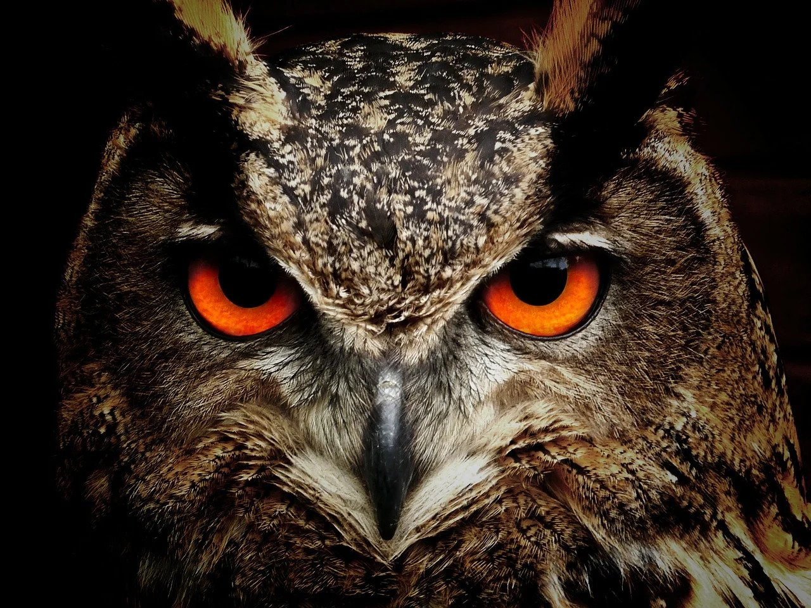

# Animals

*Enjoy the nature environment of different types of animals across the globe.*

 

----------

## UX (User Experience)

### Project Goals

The goal for this project is to teach people the beautiful view of the animals and some **facts** about what the animals do. 
One of the main goals of this project is also to teach the **importance of animals** and **why they matter in our ecosystem**.
Another minority of this goal will be to show some type of **different nature environments**, for the sake of feeling entertaining when entering
the world of animals.

### User Goals

- As a user i want to find information in **general** about several types of animals.
- As a user i want to find information about several types of animals in **depth for extra information**.
- As a user i want i want to experience several **images** of the nature and animals.
- As a user i want to find a **contact form** that is provided with **radio buttons** for different alternatives.

### User stories

- As a user i would like my site to be **entertaining** so that it can motivate the users.
- As a user i would like to be as **informative** as possible and to **educate** the users about animals.
- As a user i want to contact the owner of the site for **additional information** and **suggestions**.
- As a user i want to access **social media links** such as instagram, facebook etc.

### Site Owner Goals

- To easily **access** the site without any issues and to make it look simple.

- To **understand** the information in such a way that it wont be boring.

- To provide **more images** rather than text to attract the users so that they can digest for more information.

- In the contact form there will be a **message box** provided for the user , if they have any **related questions** towards the site.

### Requirements 

- Navigate through the website using the **navbar** to access different sections of the page as well as other pages.

- Access the **read more buttons** for information in depth.

- Access the contact form by adding your **e-mail address**.

- Access different types of **information** on different types of **images**.

### Wireframes

For the wireframes i used [marvelapp](https://marvelapp.com/). It was easy to structure and sort small things like navbar and images.
It was also easy to edit somethings like the size of a text and to place it in the same angle as the image.

I created wireframes for:

- Mobile wireframe

- Tablet wireframe

- Desktop wireframe

 #### Wireframes expectations

Most of the things were as I expected, according to the wireframes. However, there were some minor things that I readjusted.

 #### Sections in the page

#### Different animals

Another thing is that in my wireframe if we go to the "different animals" section it says that i should have a title on the left bottom, but then I saw that it did not look so well, so i decided
to just have a title/headline in the middle of the cards for a better outlook.

#### Does the animal matter

On the desktop it almost went as expected, to the wireframes but eventually when I came across the section 'why animals matter' I finally realized that I would like to readjust that headline into ''Does the animal matter" for a better understanding.

In the section of "Does animal matter" I also realized that it is better to use a carousel fade in images than just an image. The reason is because I want to attract the audience, not just by looking at paragraphs, but also to experience its nature.

#### Food chain

I also changed the arrows in the food chain section because I am describing a food chain and it would look nicer if it started with something from the top.
Therefore, I added an extra image both for the outlook and that it would describe the food chain in a more simplified way.
I also added headlines to the images.

#### Contact

In the contact section it got me a nice idea and that was to put a background image of a cat for a great look.
I also changed the description of the radio button.

### Design Choices

I chose several colors based on my own creativity and it came with the process as I was working on the project because I would like them to fit with the images as well.

#### My colors

#### Heatwave  #FB7800                            
#### Black    #000
#### White    #FFF
#### Sonic silver #777
#### Battleship grey #888

|   Heatwave  	|   Black  	|   White  	|  Sonic silver   	|   Battleship Grey  	|  	
|-	|-	|-	|-	|-	|	
| background color navbar 	| hero image background color 	|  navigation links on top of the page	| background color for almost all images 	|   box shadow for carousel  	|  	
| input color for placeholder 	                        | logo image background color	|  text of the navigation |  |  |  	
| text area ***color***	for placeholder                        | paragraph text 	|  hero image headline                              |  	|  	|  	
| ***color*** for radio button text 	                        | hovering on anchor links on top of the page                        |  hero image paragraph text                |  	|  	|  	
| ***background color*** for submit button 	|  ***background color*** for ***radio button text***	|   	|  	|   	|  	
| background color for headline in contact section  | anchor links in footer    |   |  |  |
| when radio buttons are checked  |  |   |   |   |

